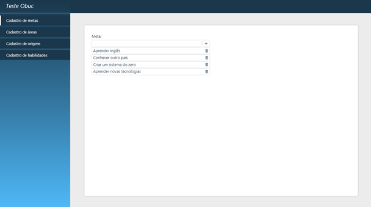

 
 

# 🤓 Desafio estágio Obuc
## O que é esperado do teste?
Criar uma página web que permita visualizar, cadastrar e excluir metas seguindo o layout abaixo: 

## O que essa aplicação deve fazer?
- Exibir metas
- Adicionar novas metas
- Remover metas

## Quais tecnologias eu **devo** usar?
- HTML
- CSS
- Javascript

## Quais tecnologias eu **posso** usar?
Fique a vontade em utilizar bibliotecas de Javascript ou facilitadores como jQuery, Bootstrap.

## Como devo começar?
Você irá criar um `fork` deste repositório e irá codificar sua solução dentro da pasta raiz, após isso você irá enviar o link do seu `fork` para o requisitante do teste.

## Links que podem ajudar
- [Como fazer um fork no Github](https://www.youtube.com/watch?v=q-QTbNu8Ybc)
- [Como funciona HTML](https://developer.mozilla.org/pt-BR/docs/Learn/Getting_started_with_the_web/HTML_basics)
- [Como funciona CSS](https://developer.mozilla.org/pt-BR/docs/Learn/CSS/First_steps/How_CSS_works)
- [O que é Javascript](https://developer.mozilla.org/pt-BR/docs/Learn/JavaScript/First_steps/What_is_JavaScript)